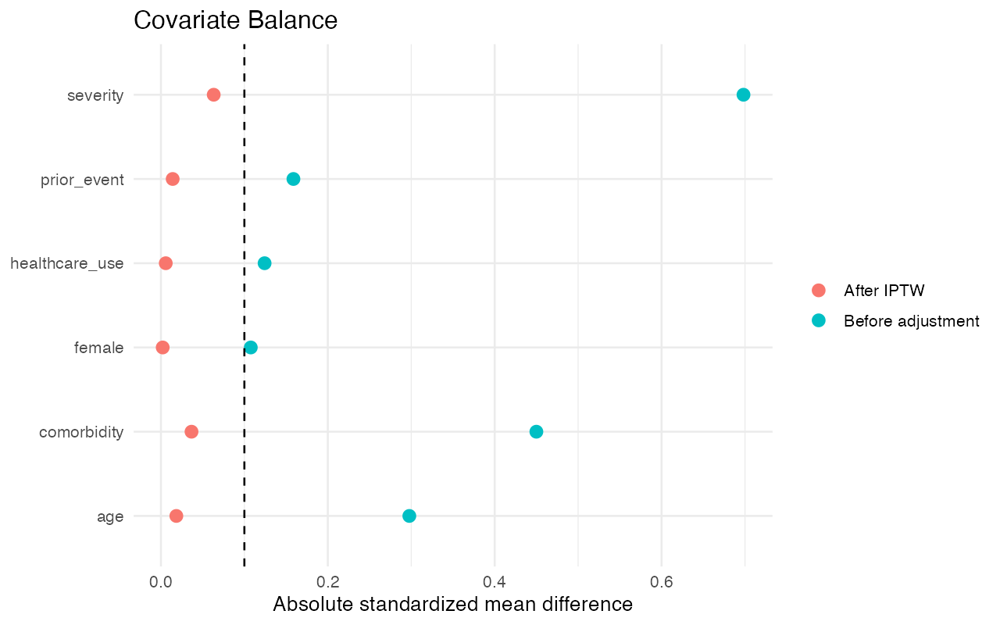
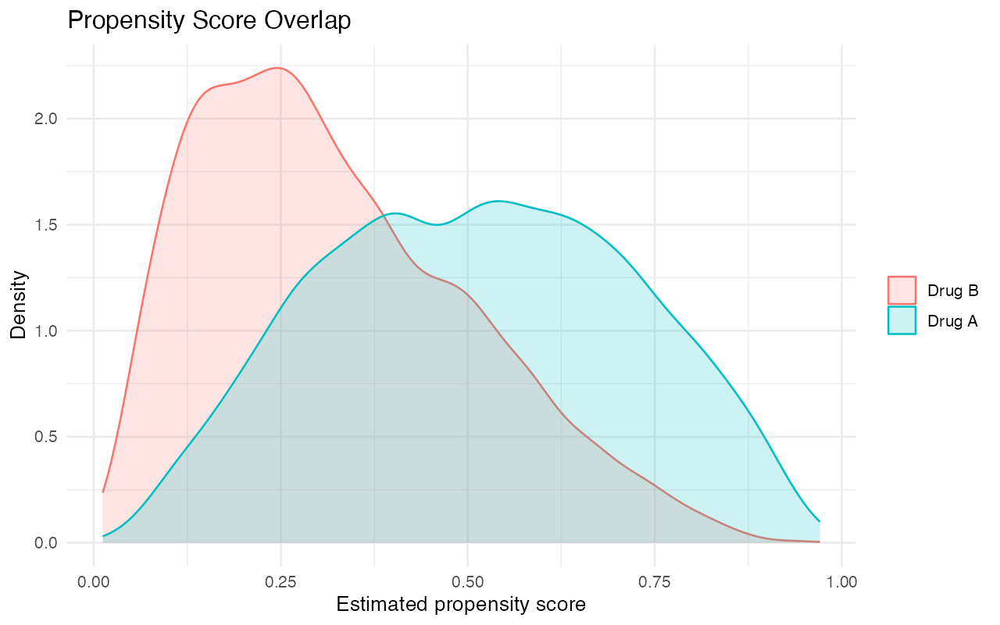
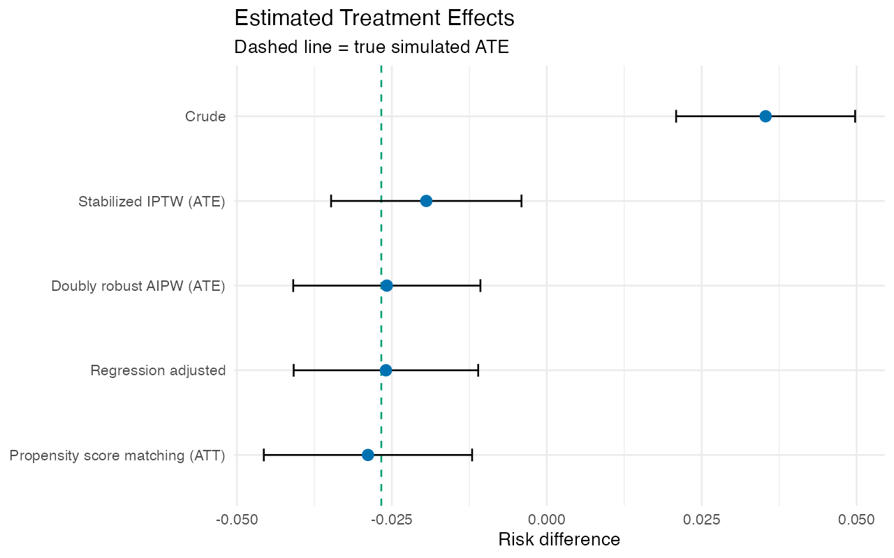
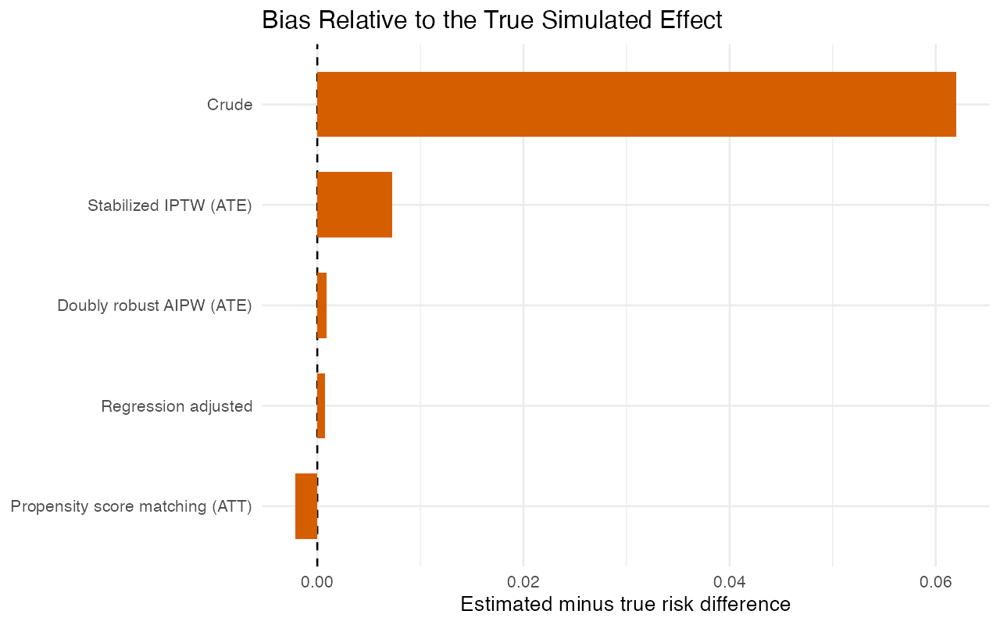

# Interactive RWE Causal Inference Lab

An interactive pharmacoepidemiology simulation showing how treatment-selection bias, positivity, unmeasured confounding, and analytical method choice change estimated comparative effectiveness.

**Objective:** Demonstrate the full real-world evidence workflow—from cohort definition and Table 1 through propensity-score diagnostics, treatment-effect estimation, and assumption stress testing.

**Methods:** Crude comparison, regression standardization, propensity-score matching, stabilized IPTW, doubly robust AIPW, standardized mean differences, overlap diagnostics, and bias benchmarking against a known simulated effect.

**Primary estimand:** Average treatment effect of Drug A versus Drug B on one-year cardiovascular-event risk, reported as a risk difference.

**Deliverables:** [Interactive Shiny app](app/app.R) | [HTML report](docs/index.html) | [Synthetic cohort](data/generated/synthetic_rwe_cohort.csv) | [Effect estimates](output/tables/treatment_effects.csv) | [Model code](R/)

## Dashboard guide

- **Cohort:** patient counts, treatment groups, outcome events, and a live Table 1.
- **Balance & overlap:** Love plot, propensity-score densities, and positivity warnings.
- **Treatment effect:** five estimators with intervals and an interactive forest plot.
- **What if the method is wrong?:** compares estimates with the known simulated truth as assumptions deteriorate.
- **Methods:** explains estimands, diagnostics, and why adjustment does not solve unmeasured confounding.

Users can change cohort size, treatment prevalence, age/comorbidity/severity-driven treatment selection, unmeasured confounding, and positivity stress, then click **Run scenario**.

## Main findings

### 1. Treatment groups are imbalanced before adjustment

Measured confounding by indication is visible in baseline standardized mean differences. Stabilized IPTW substantially improves balance in the base case.

### 2. Overlap is an analysis requirement, not a cosmetic plot

The overlap view shows whether treated and comparison patients have comparable estimated treatment probabilities. Stressing treatment selection generates explicit positivity warnings.

### 3. Analytical decisions change the estimated effect

Crude and adjusted results can differ materially. The dashed line identifies the known simulated ATE, allowing method performance to be evaluated rather than assumed.

### 4. Causal methods cannot repair unmeasured confounding

Increasing the hidden common cause can move PSM, IPTW, and AIPW away from the truth even when measured covariate balance appears satisfactory.

## Study design

- Synthetic active-comparator pharmacoepidemiology cohort
- Drug A versus Drug B at baseline
- Binary one-year cardiovascular outcome
- Measured demographics, comorbidity, severity, prior events, and healthcare use
- Known counterfactual risks for benchmarking estimator bias

## Repository structure

```text
R/             simulation, estimators, diagnostics, and plots
data/input/    transparent default parameters
data/generated synthetic patient-level analytical cohort
analysis/      reproducible base-case workflow
output/        analysis tables and four main figures
docs/          browser-ready report
app/           interactive Shiny dashboard
tests/         model and balance checks
run_all.R      complete pipeline
```

## Reproduce

```r
install.packages(c("shiny","ggplot2"))
source("run_all.R")
shiny::runApp("app")
```

## Roadmap

- V2: baseline versus ever-treated exposure definitions and immortal-time bias warning
- V3: difference-in-differences module
- V4: target-trial emulation workflow

## Interpretation limits

All data and clinical relationships are simulated. Confidence intervals are educational approximations. The app does not represent any named medication and must not be used for clinical or regulatory decisions.
